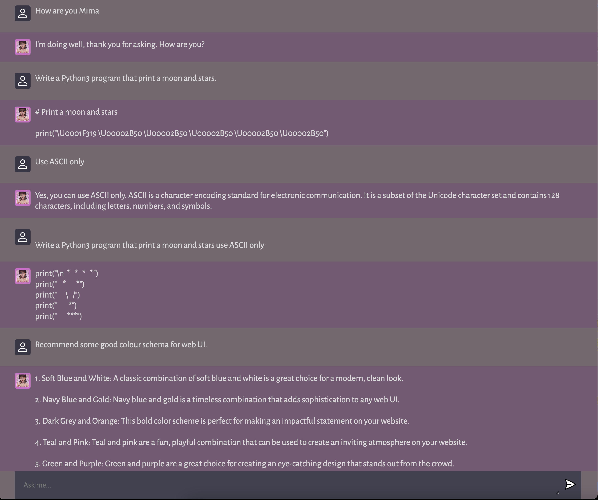

# Mima - Chat Coding AI

Deployed at <https://mima-demiao.vercel.app>

Based on tutorial by [JavaScript Mastery](https://www.youtube.com/watch?v=2FeymQoKvrk&t=26s&ab_channel=JavaScriptMastery)

## Example

<!--  -->


## Prerequisite

- Node.js (v18.12.1)
- npm (8.19.2)

## Usage

Clone the repo to your computer by running the following command in a terminal.
```shell
git clone git@github.com:demiaochen/Mima-Coding-AI.git
``` 

Obtain the API key from <https://openai.com/api/> (<https://beta.openai.com/account/api-keys>).

To run it locally, you need to change ```server_addr``` in ```client/script.js``` to ```http://localhost:6721``` (see comment in ```script.js```).

``` shell
# Add API key to .env
sh add_api_key.sh [YOUR_API_KEY]

# Run client and server (The script uses screen to run the server and client)
sh local_run.sh
```

Then open <http://localhost:5173/> on browser.

To shut down client and server:

``` shell
sh shut_down.sh
```
or 

```shell
pkill screen
```

## Tutorial

### Client

Initialising JS project

``` shell
npm create vite@latest client --template vanilla
cd client && npm install

# Download style.css
curl -O  https://gist.githubusercontent.com/adrianhajdin/2059ca74452a18d1560aac9499f58900/raw/c394c330ea4a1e5a9eb4a48b06eaf6668035a436/style.css
```

[Assets Download Link](https://minhaskamal.github.io/DownGit/#/home?url=https://github.com/adrianhajdin/project_openai_codex/tree/main/client/assets)

### Server

``` shell
mkdir server && cd server
npm init -y
npm install cors dotenv express nodemon openai
```

- OpenAI text-davinci-003
<https://beta.openai.com/playground/p/default-openai-api?lang=node.js&model=text-davinci-003>

### Deployment

**Server: Render**

Add OPENAI_API_KEY to Environment

(Deployed at <https://mima.onrender.com/>)

**Client: Vercel**
